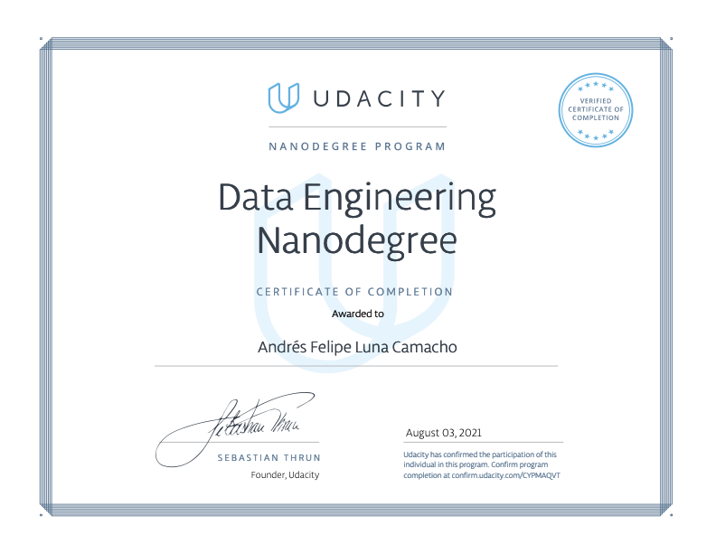

# DE_Nanodegree
Data Engineering Udacity Nanodegree Projects

## Contents
1. [Data modeling with PostgresSQL](postgres/README.md)
2. [Data modeling with Apache Cassandra](cassandra/README.md)
3. [Cloud Data Warehouses with Redshift](redshift/README.md)
4. [Data Lakes with Spark](spark/README.md)
5. [Data Pipelines with Airflow](airflow/README.md)
6. [Capstone Project](capstone/README.md)

