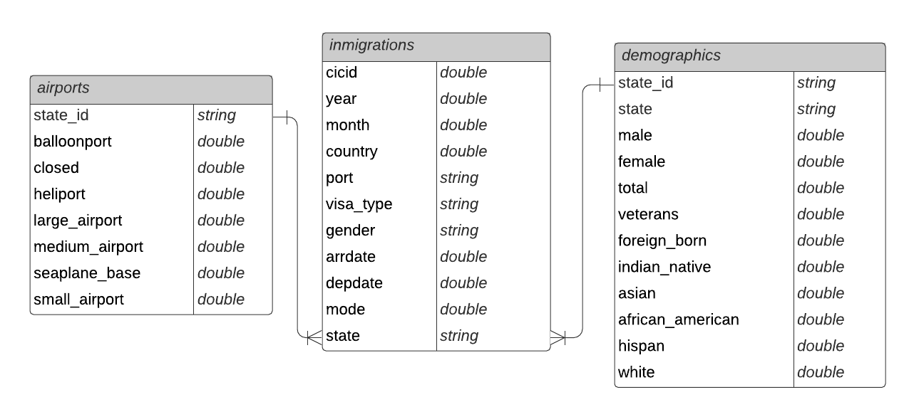
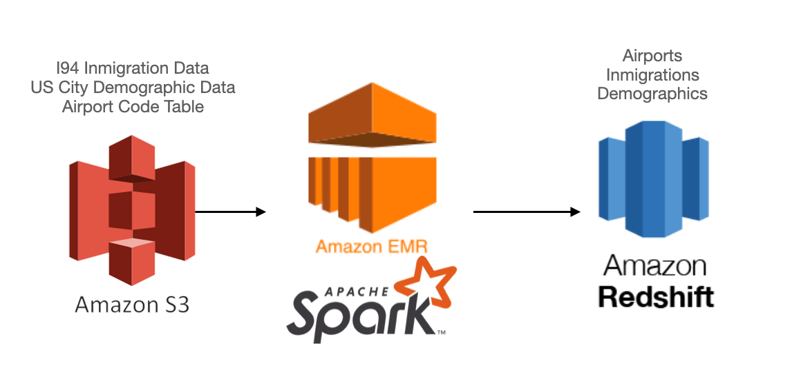

# US Inmigration Analysis 2016
## Data Engineering Capstone Project

### Table of contents
1. [Project Summary](#summary)
    1. [Context](#context)
    2. [Scope](#scope)
    3. [Possible Target Questions](#target_questions)
2. [Data](#data)
3. [Cleaning Steps](#cleaning)
4. [Usage](#usage)
    1. [Tools](#tools)
    2. [Pre-requisites](#prerequisites)
    3. [Run](#run)
5. [Data Model](#datamodel)
6. [Data Pipeline Steps](#datapipeline)
7. [Hypothetical Scenarios](#other)

### 1. Project Summary <div id='summary'/>
#### Context <div id='context'/>
US Inmigration data is highly valuable for government policy definitions. Firstly, analizing this transactional records can give us important insights about which states and airports are the most critical for inmigrants. Secondly, it can also allow us to identify patterns about the most important inmigrant features (nationality, race, gender, etc) who visit US. Understaning this information migth allow different organizations to improve their strategies when facing inmigration issues.
#### Scope <div id='scope'/>
The goal of the following project is to build data pipeline that uses 2016 I94 Immigration Data, along with other raw datasets, to prepare a database intended for analytical purposes. The project aims to use data engineering technologies to extract information from different sources, as well as transform and load the data in a DWH for future analysis.
#### Possible Target Questions <div id='target_questions'/>
Users migth be able to answer the following questions by querying their Redshift DWH:
1. Where did the majoriy of the 2016 inmigrants come from?
2. Which is the gender with more 2016 inmigrations?
3. Which were the states that received more inmigrants in 2016?
4. How many available airports are in the states that received more inmigrants in 2016?
5. How many inmigrants were received in US most populated cities?
6. Wich were the states that received more white/black/asian inmigrants?

### 2. Data <div id='data'/>
Dataset|File Format|Source|# Records|
---|---|---|---|
I94 Immigration Data|Parquet|[Link](https://www.trade.gov/national-travel-and-tourism-office)| 3096313|
U.S. City Demographic Data| CSV|[Link](https://public.opendatasoft.com/explore/dataset/us-cities-demographics/export/)  |2891|
Airport Code Table|CSV|[Link](https://datahub.io/core/airport-codes#data) |55075|

* *I94 Immigration Data*: 2016 US inmigration records with different features about inmigration transactions (gender, arrival and departure date, airport, state, etc.). Original dataset has 28 columns but for intended analysis, 16 columns were selected.
* *U.S. City Demographic Data*: Demographic metrics by city name (total population, population by gender, race, etc.). All 12 columns were used for intended analysis.
* *Airport Code Table*: Airport codes and corresponding cities, along with other airport features (type, coordinates, iso_region, etc.)

### 3. Cleaning Steps <div id='cleaning'/>
1. *Feature selection*: Depending on the corresponding dataset, different feature columns were selected. For airport and demographic sets, all features were taken. For inmigration database, since there were many columns with no analytical value (IDs, flags, unique keys), only a small portion of features related with dates and numeric values were used.
2. *Null Values Validation*: Records with null values in any of the selected features were discarded. Airport and demographic sets had less than 30 null records. Inmigration set didn't have null values.
3. *Data Aggregations*: Airport and demographics datasets were aggregated by US State in order to enable joins with Inmigration dataset.
4. *Duplicated records*: To ensure quality consistency, duplicated records were deleted after aggregation transformations.
5. *Column renaming*: Remove white spaces and special characters in column names.

### 4. Usage <div id='usage'/>
#### 1. Tools <div id='tools'/>
1. *Amazon EMR*: Used to read and process input databases:
    * Apache Spark: Used to load Inmigrations dataset. 
    * Pandas: Used to load Airports and Demographics datasets.
2. *Amazon Redshift*: Used to load the analytical tables and query target requests.
#### 2. Pre-requisites <div id='prerequisites'/>
1. Valid access rigths to running AWS EMR cluster
* Spark 2.4.3
* Pandas
* Redshift-jdbc42-2.0.0.7 [(link)](https://docs.aws.amazon.com/redshift/latest/mgmt/jdbc20-download-driver.html)
2. Valid access rights to running AWS Redshift cluster

#### 3. Run <div id='run'/>
1. Connect to AWS EMR cluster via SSH.
2. Clone this repository.
3. Verify existance of ```redshift-jdbc42-2.0.0.7.jar``` in ```drivers``` folder. Otherwise, download it manually.
4. Update missing information in the ```config.cfg``` file.
5. Run ```/opt/conda/bin/spark-submit --jars drivers/redshift-jdbc42-2.0.0.7.jar etl.py```.

Note: Load *inmigrations* table in Redshift can take several minutes.

### 5. Data Model <div id='datamodel'/>
A Start schema was selected for the project data model. This schema allows us to simplify queries when analyzing the data, as well as improving speed for information retrieval. The fact and dimension tables are shown above:



* Fact table: *inmigrations*

| Column Name | Description | Provenance |
| ----------- | ----------- | ---------- |
| cicid| Inmigration Id|I94 Immigration Data|
| year| Year of record|I94 Immigration Data|
| month| Month of record|I94 Immigration Data|
| country| Provenance country|I94 Immigration Data|
| port| Port code|I94 Immigration Data|
| visa_type| Type of visa|I94 Immigration Data|
| gender| Inmigrant's gender|I94 Immigration Data|
| arrdate| Arrival date|I94 Immigration Data|
| depdate| Departure date|I94 Immigration Data|
| mode| Transportation mode |I94 Immigration Data|
| state| US state code |I94 Immigration Data|

* Dimension table: *airports*

| Column Name | Description | Provenance |
| ----------- | ----------- | ---------- |
| state_id| US state code|Airport Code Table|
| balloonport| State's number of balloon ports |Airport Code Table|
| closed| State's number of closed ports |Airport Code Table|
| heliport| State's number of helipoerts |Airport Code Table|
| large_airport| State's number of large airports |Airport Code Table|
| medium_airport| State's number of medium airports |Airport Code Table|
| seaplane_base| State's number of seaplane bases |Airport Code Table|
| small_airport| State's number of small airports |Airport Code Table|

* Dimension table: *demographics*

| Column Name | Description | Provenance |
| ----------- | ----------- | ---------- |
| state_id| US State code|U.S. City Demographic Data|
| state|State name|U.S. City Demographic Data|
| male|Male population in the state|U.S. City Demographic Data|
| female|Female population in the state|U.S. City Demographic Data|
| total|Total population in the state|U.S. City Demographic Data|
| veterans|Number of veterans in the state|U.S. City Demographic Data|
| foreign_born|Number of foreign borns in the state |U.S. City Demographic Data|
| indian_native|Number of indian natives in the state|U.S. City Demographic Data|
| asian|Number of Asian people in the state|U.S. City Demographic Data|
| african_american|Number of african american people in the state|U.S. City Demographic Data|
| hispan|Number of latinos in the state|U.S. City Demographic Data|
| white|Number of withe people in the state|U.S. City Demographic Data|

### 6. Data Pipeline Steps <div id='datapipeline'/>
An ELT strategy was used to build the data model:

1. E (Extract): The datasets were already downloaded and provided by Udacity, so there was no need to implement an extraction algorithm. Optionally, you can download the datasets and reference them locally, or store them in a S3 bucket.
2. L (Load): The datasets were loaded directly in a Spark Datalake (EMR) without performing any transformation or table definition.
3. T (Transform): Two different functions were applied to each of the original databases:
* *clean_data*: Select columns, remove null records and duplicates.
* *transform_data*: Aggregate columns, rename columns.
4. Quality checks: Once uploaded in Redshift, the following validations were made:
* Schema validation: Correct columns
* Number of rows of each table > 0
* Number of null values for each column = 0 

### 7. Hypothetical Scenarios <div id='other'/>
* *If the data was increased by 100X*: Data sources are loaded and processed in an EMR cluster which has flexible scalability capabilities. Therefore, adding more nodes to the cluster would be a feasible and fast solution.
* *If the pipelines were run on a daily basis by 7 am*: The only database that could potentially be updated on a daily basis is the *inmigrations* table. If that is the case, implementing an Airflow DAG that reads and transforms this database daily could be a feasible solution.
* *If the database needed to be accessed by 100+ people*: Analytical tables were loaded in a Redshift cluster, which has easy scalability capabilities. Therefore, adding more nodes to the cluster would target the increment of user requests.